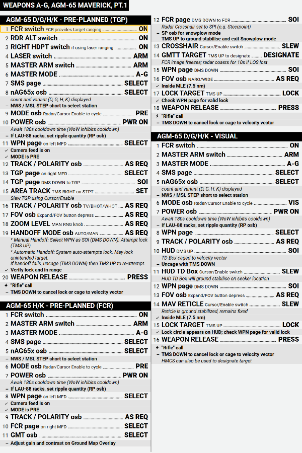
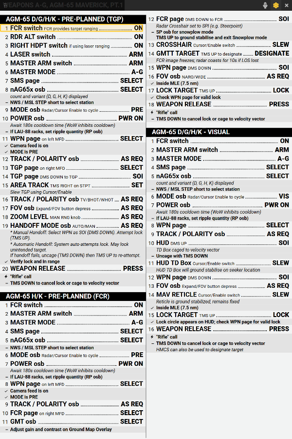
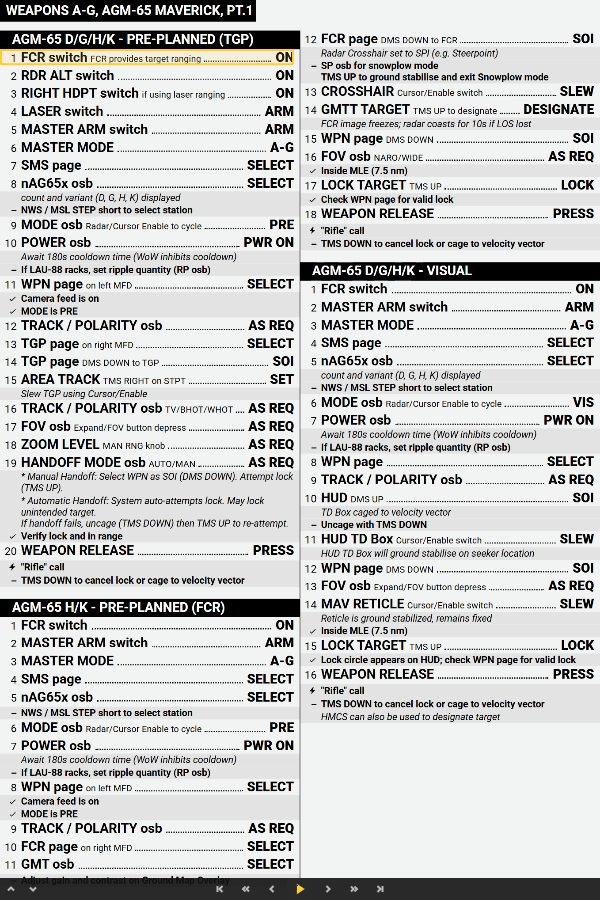
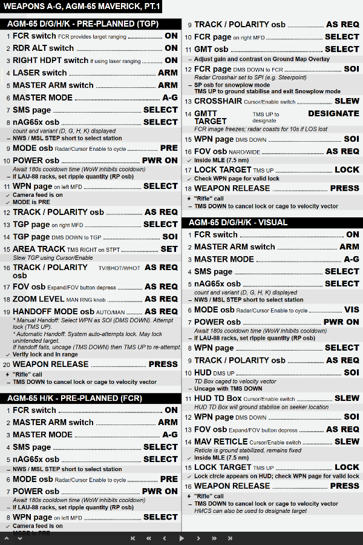
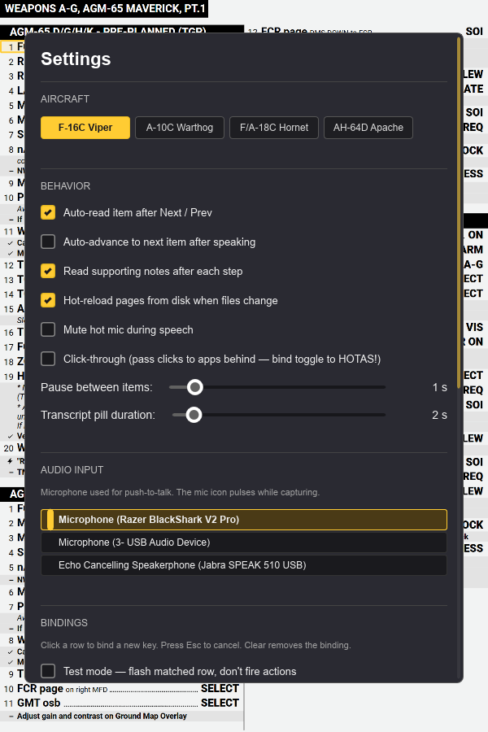
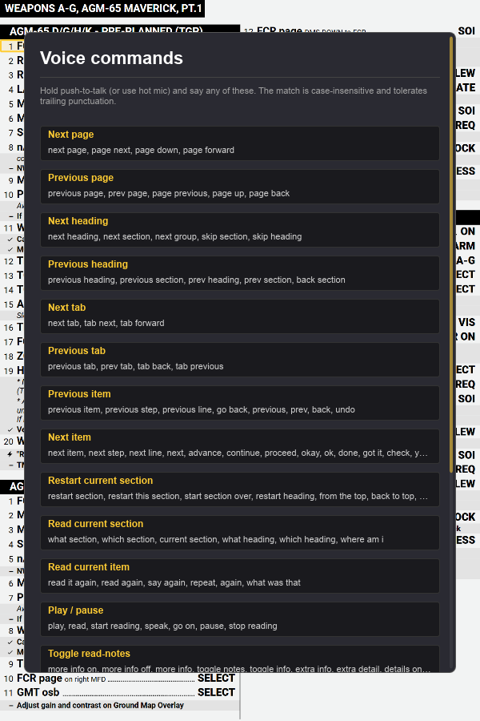

# DCS Kneeboard

A Windows always-on-top overlay for DCS World that turns a pile of static
checklist PNGs into a voice-controlled, kneeboard overlay. Push a HOTAS
button, say *"next page"* or *"what section"*, and the overlay reads the
matching checklist item aloud — entirely offline.

<p align="center">
  
</p>

## What it does

- **Reads checklists aloud** with WinRT TTS, item by item, with auto-advance.
- **Voice commands** via local Whisper (`base.en`) — say *"next"*, *"next page"*,
  *"restart section"*, *"what section"*, *"settings"*, etc.
- **Push-to-talk** or **hot-mic toggle** — bind to any HOTAS button.
- **All input is bindable** — keyboard, gamepad, HOTAS (FreeJoy, Cougar, Warthog, …).
- **Click-through mode** so the window doesn't steal focus while flying DCS.
- **Hot-reload** of kneeboard sources when the sibling generator rebuilds them.
- **Tabs** — generator output, raw image folders, and DCS's native
  Saved Games kneeboards in one window.
- **Per-aircraft pages** with `{aircraft}` placeholders resolved against the
  current module.
- **100% offline at runtime** — no cloud STT, no telemetry.

## Screenshots

### The overlay

The window is chromeless by default — just the page and the highlighted
checklist item. Chrome fades in as you hover the edges, then fades back
out. All controls also have keyboard / HOTAS / voice bindings, so you
rarely need the mouse.

| Default state | Hover top → title bar |
| :---: | :---: |
|  |  |

| Hover bottom → nav buttons | Hover left → tab strip |
| :---: | :---: |
|  |  |

### Settings + voice help

| Settings panel | Voice command help |
| :---: | :---: |
|  |  |

Settings lists every action and its current binding; click any row and
press a key or HOTAS button to rebind it. Test-mode flashes the matched
row on press so you can identify which button does what without firing
the action.

The voice-commands panel is self-documenting — every phrase the router
matches is shown grouped by the action it triggers, generated from the
same rules table that does the matching.

## Quick start

```powershell
# Default build (no STT — push-to-talk records audio but doesn't transcribe).
cargo run
```

To enable speech-to-text via Whisper, you need LLVM + CMake on the build
host (one-time setup):

```powershell
# 1. Install LLVM (provides libclang.dll for bindgen)
winget install --id LLVM.LLVM

# 2. Install CMake (whisper.cpp build system)
winget install --id Kitware.CMake

# 3. Restart your shell so PATH picks up the new tools.

# 4. Download a Whisper GGML model (~148 MB)
Invoke-WebRequest `
  -Uri "https://huggingface.co/ggerganov/whisper.cpp/resolve/main/ggml-base.en.bin" `
  -OutFile "models/ggml-base.en.bin"

# 5. Build with the feature flag (first build compiles whisper.cpp — slow,
#    subsequent builds are fast).
cargo run --features whisper-stt
```

The app prints the chosen model path on startup. If no model is found, STT
silently disables and the rest of the app keeps working.

## Voice commands (excerpt)

| Action | Examples |
| --- | --- |
| Next item | "next", "next item", "okay", "go", "done" |
| Previous item | "back", "previous", "go back" |
| Next page | "next page", "page down" |
| Previous page | "previous page", "page up" |
| Next heading | "next heading", "next section" |
| Restart section | "restart section", "from the top", "start over" |
| Read current section | "what section", "where am I" |
| Play / pause | "play", "pause", "read" |
| Repeat | "repeat", "again", "say again" |
| Hot mic toggle | "hot mic", "open mic" |
| Read notes toggle | "more info on / off" |
| Click-through toggle | "click through", "pass through" |
| Open settings | "settings", "open settings" |
| Open voice commands | "voice commands", "what can I say" |
| Cancel | "cancel", "stop", "never mind" |

Full list lives in `src/voice_router.rs`; the in-app **Voice Commands**
panel is generated from the same table.

## Architecture

```
┌──────────────────────────────────────────────────────┐
│ Slint UI (page Image + highlight Rect + chrome)      │
└────┬─────────────────────────────────────────────────┘
     │
     ▼ (Rust)
┌─────────────────┐  ┌─────────────────┐  ┌─────────────┐
│ ChecklistCtrl   │  │ Voice Router    │  │ TtsEngine   │
│   nav state     │  │ transcript→Act  │  │  WinRtTts   │
└────┬────────────┘  └────────┬────────┘  └──────┬──────┘
     │                        ▲                  │
     ▼                        │                  ▼
┌─────────────────┐  ┌────────┴────────┐  ┌─────────────┐
│ PageStore       │  │ SttEngine       │  │ AudioCapture│
│  PNG + sidecar  │  │  WhisperStt     │◀─┤  cpal + VAD │
│  hot-reload     │  │  worker thread  │  │ 16 kHz mono │
└─────────────────┘  └─────────────────┘  └─────────────┘
        ▲                   ▲                    ▲
        │                   │                    │
┌───────┴────────┐  ┌───────┴──────────┐  ┌──────┴──────┐
│ kneeboards     │  │ models/          │  │ default mic │
│ generator out  │  │ ggml-base.en.bin │  │             │
│ (sibling repo) │  └──────────────────┘  └─────────────┘
└────────────────┘
```

Voice events flow:

1. Audio capture runs on a cpal callback thread, accumulating samples in a
   shared buffer.
2. While **push-to-talk** is held (or **hot mic** is latched), the buffer
   fills. On release / on detected silence the chunk is downmixed + resampled
   to 16 kHz mono.
3. The PCM is shipped via mpsc to a dedicated whisper worker thread.
4. The transcript comes back over another mpsc; a UI-thread Timer drains it
   and feeds it to the voice router.
5. Matched actions are dispatched through the same path as keyboard/HOTAS
   triggers, so voice and physical input share identical behaviour.

## Project layout

```
DCSBoards/
  src/
    main.rs              # Slint UI + AppState + dispatch
    actions.rs           # Action enum (single source of truth)
    voice_router.rs      # transcript → Action mapping
    input/               # bindings + gilrs poller
    audio/               # cpal capture + VAD + rubato resample
    stt/                 # whisper-rs wrapper (feature-gated)
    tts/ (in main)       # WinRT speech synth + pronunciation map
    tabs.rs              # tab registry, manifest loader, lazy page decode
    config.rs            # config.toml schema (aircraft, tabs)
    settings.rs          # settings.toml schema (per-user state)
    overlay.rs           # Win32 WS_EX_TRANSPARENT click-through
    watcher.rs           # notify hot-reload
  models/                # whisper GGML models (gitignored)
  pages-sample/          # sample F-16C kneeboards for dev
  ui/                    # (reserved for future .slint splits)
  scripts/               # capture-screenshot.ps1, etc.
  docs/screenshots/      # README assets
  CLAUDE.md              # architecture notes for AI assistance
  SPEC.md                # authoritative design doc
```

## Configuration

Two files; **edit by hand**, no in-app editor for these.

**`config.toml`** — static project config: aircraft list, tab definitions.
Shared via git (this file is checked in for the sample setup).

```toml
[[aircraft]]
id = "F-16C_50"
label = "F-16C Viper"

[[tabs]]
id = "checklists"
label = "Generated Checklists"
icon = "clipboard-list"
source.kind = "generator"
source.path = "C:/path/to/kneeboards/output/{aircraft}"

[[tabs]]
id = "dcs"
label = "DCS Kneeboards"
icon = "plane"
source.kind = "dcs_kneeboards"   # resolves to %USERPROFILE%/Saved Games/DCS/Kneeboard/{aircraft}
```

**`settings.toml`** — per-user state: window position, audio device,
bindings, behaviour toggles. Gitignored. Auto-created on first run; delete
to reset.

**`pronunciation.toml`** — TTS abbreviation overrides (`PWR → POWER`,
`FLCS → Flickus`, etc). Reload with F5 without restarting.

## Bindings + voice phrases

Every Action is bindable to:
- a **keyboard combo** — fires while window has focus
- a **gamepad / HOTAS button** via `gilrs` — fires regardless of focus
- a **voice phrase** — fires when transcribed from STT

Bindings are recorded by clicking a row in Settings ▸ BINDINGS and pressing
the desired key / button. Last-writer-wins on conflicts.

## Defaults

| Action | Default trigger |
| --- | --- |
| Next item | `Space` |
| Previous item | `Backspace` |
| Play / pause | `R` |
| Next heading | `H` |
| Previous heading | `Shift+H` |
| Page down / up | `PageDown` / `PageUp` |
| Toggle click-through | `Ctrl+Alt+K` |
| Toggle visibility | `Ctrl+Alt+V` |
| Reload pronunciation | `F5` |
| Cancel / close panels | `Esc` |
| Push-to-talk | *unbound — bind to a HOTAS trigger* |
| Hot mic toggle | *unbound* |

## VR mode

When built with the `vr` cargo feature, the overlay can render itself as a world-locked SteamVR overlay instead of a desktop window — the kneeboard floats in the cockpit space ~0.6 m in front of you and stays put as you look around. Voice + HOTAS work exactly the same; only the rendering changes.

```bash
cargo build --release --features vr
```

The VR runtime is auto-detected:

| `settings.toml` `vr_mode` | Behaviour |
|---|---|
| `"auto"` *(default)* | Enter VR if SteamVR runtime + HMD both present, otherwise stay on desktop |
| `"vr"` | Force VR mode regardless of detection |
| `"desktop"` | Force desktop mode; never init OpenVR |

Plugging / unplugging the HMD mid-session is re-evaluated every 2 s and triggers the desktop ↔ VR switch transparently.

### Positioning the overlay

| Voice phrase | HOTAS-bindable action | What it does |
|---|---|---|
| "place kneeboard here" | `VrPlaceHere` | Snap to in front of where you're looking right now |
| "move closer" / "move further" | `VrMoveCloser` / `VrMoveFurther` | ±10 cm world-Z |
| "move up" / "move down" / "move left" / "move right" | `VrMoveUp` etc. | ±10 cm world XYZ |
| "make bigger" / "make smaller" | `VrSizeUp` / `VrSizeDown` | ±5 cm overlay width (clamped 15 cm – 1 m) |
| "reset kneeboard" | `VrResetPose` | Back to the default forward+down pose |

Pose + size are saved per aircraft (`vr_poses` in `settings.toml`), so the F-16 kneeboard can live on the right console while the A-10 kneeboard lives above the HUD.

### Headset compatibility

VR mode goes through SteamVR. Anything that talks SteamVR works:

- **Quest 2 / 3 / Pro** via Virtual Desktop, Air Link, or Link cable
- **Valve Index, HTC Vive**, original Vive Pro
- **WMR headsets** via the SteamVR-WMR bridge
- **Pimax** (any model that supports SteamVR)

For runtimes that don't go through SteamVR (Quest standalone, Varjo Aero in native OpenXR mode), VR mode won't engage. Fall back to a desktop-overlay-in-VR tool like [OVR Toolkit](https://store.steampowered.com/app/1068820/OVR_Toolkit/) or [XSOverlay](https://store.steampowered.com/app/1173510/XSOverlay/) and pin the regular desktop window into your view that way. A native OpenXR path (issue #30 follow-up) may land later.

### Limitations in VR mode

- Keyboard hotkeys still fire but you can't see the keyboard — bind PTT and the navigation actions to your HOTAS before flying.
- Click-through and the opacity slider are no-ops (no mouse, OpenVR overlays handle alpha differently).
- The chrome (settings panel, voice-commands help, mic indicator, pills) **only renders to the desktop window**, not into the headset. The VR view shows page + highlight only. Fix the kneeboard via voice; everything else stays in the audio loop.

## Related project — kneeboards generator

The static pages this overlay consumes are produced by a sibling Node.js +
Puppeteer build at `C:\Users\anpea\OneDrive\Documents\DevProjects\kneeboards`.
It reads markdown checklists, renders them to PNG via headless Chromium,
and emits a sidecar JSON file per page with the structured item model and
per-item bounding boxes — the contract this overlay relies on.

The overlay does **not** parse markdown itself. The sidecar JSON schema
is the formal boundary between the two repos.

## Out of scope (v1)

macOS / Linux, cloud STT/TTS, multiplayer / telemetry, in-app checklist
editing, touch UI, modifying DCS, signed installer.

See `SPEC.md` for the full design and `CLAUDE.md` for the working notes.

## Status

Active development. The overlay is functional end-to-end: page rendering,
TTS readout, push-to-talk and continuous hot-mic STT, voice routing, hot
reload, click-through, persistent bindings. VR mode (`--features vr`,
SteamVR overlay) is functional with auto-switching desktop ↔ VR and
per-aircraft pose persistence — see [VR mode](#vr-mode). M9 (signed
installer + auto-updater) is the remaining gap before public release.
